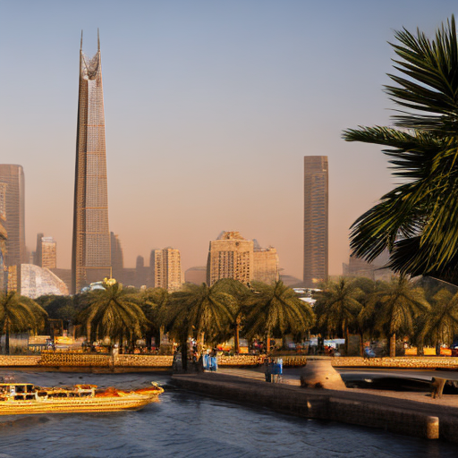
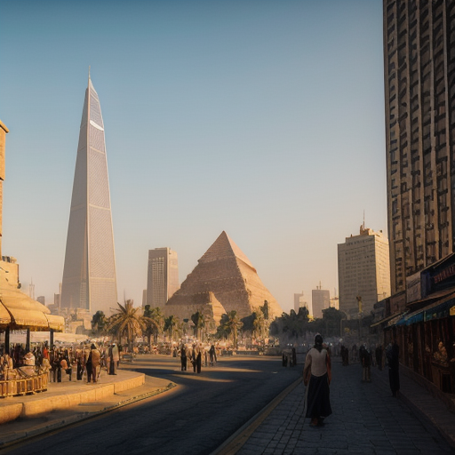
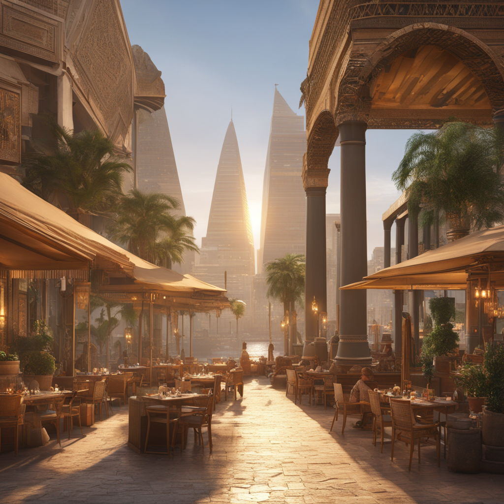
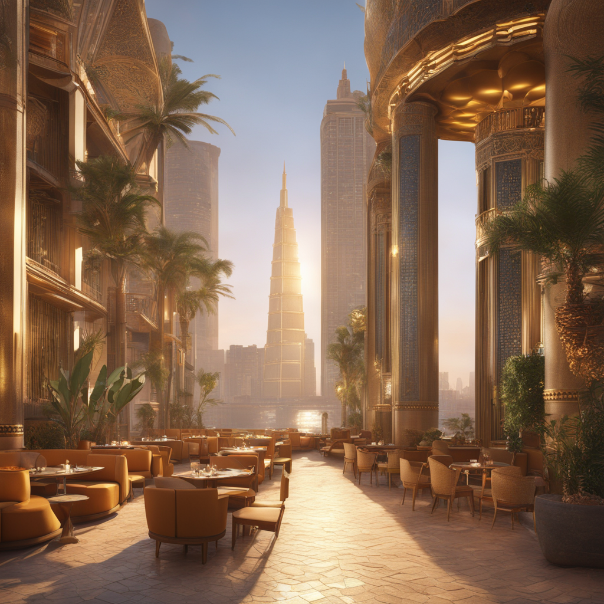

# DEPI – Text-to-Image  Generator 🎨

A state-of-the-art image generation pipeline combining **LLM prompt enhancement** with advanced **diffusion models**.

---

## 📖 Overview

**DEPI_Txt2Img_Gen** transforms simple text ideas into high-quality AI-generated images. Using **Google Gemini** for prompt enhancement, your basic description becomes a professional-grade prompt ready for **SDXL** or **Kandinsky 2.2**, producing photorealistic or artistic visuals without mastering prompt engineering.

---

## ⚙️ System Architecture

**Workflow:**

1. **Input Interface:**\
   Enter a text prompt and select aspect ratio and model.

2. **LLM Processing (Gemini):**\
   Gemini enriches the prompt with lighting, style, composition, and artistic details.

3. **Image Generation:**

   - **SDXL:** Photorealistic images, characters, architecture
   - **Kandinsky 2.2:** Artistic, mixed media, creative fusion

4. **User Interface:**\
   The enhanced prompt and generated image are displayed for transparency and learning.


---

## 🚀 Key Features

- **Automated Prompt Engineering:** Gemini converts keywords into cinematic, high-detail prompts
- **Dual-Model Generation:** Switch seamlessly between SDXL and Kandinsky 2.2
- **Aspect Ratio Control:** Supports Square, Portrait, Landscape
- **Transparent Workflow:** View enhanced prompts to understand AI interpretation
- **Interactive Web UI:** Built with **Gradio**, user-friendly for local testing

---

## 🧠 Models Overview

| Model             | Type             | Best Use                   | Notes                                                 |
| ----------------- | ---------------- | -------------------------- | ----------------------------------------------------- |
| **SDXL**          | Latent Diffusion | Photorealism               | High detail, correct anatomy, dynamic range           |
| **Kandinsky 2.2** | Latent Diffusion | Digital Art & Illustration | Blends concepts, vibrant visuals                      |
| **Gemini**        | Multimodal LLM   | Prompt Enhancement         | Enriches user input with style, lighting, composition |

---

## 🖼️ Output / Results

Here are some example outputs from **DEPI – Text-to-Image  Generator** using different pipelines.

### Enhanced Prompt
The enhanced prompt generated for a simple idea:
Egyptian cafe, Cairo, Nile River, futuristic skyline, tall glass towers, ancient pyramids in background, bustling street scene, warm ambient lighting, golden hour, cinematic, photorealistic, hyper-detailed, octane render, 8K, volumetric lighting, trending on ArtStation, Unreal Engine 5, rim lighting, atmospheric perspective, high contrast, sharp focus, vibrant colors, epic composition, ultra quality.

---

### Generated Images

<p align="center">
  
  
</p>
<p align="center">
  
  
</p><p align="center">
  
  
</p><p align="center">
  
  
</p>

---

## 🛠️ Installation & Setup

1. **Prerequisites:**

   - Python 3.8+
   - NVIDIA GPU with CUDA (recommended)
   - Git

2. **Clone Repository:**

```bash
git clone [https://github.com/YourUsername/Imagica.git](https://github.com/mohamedemad6244/DEPI_Txt2Img_Gen.git)
cd DEPI_Txt2Img_Gen
```

3. **Create Virtual Environment:**

```bash
# Windows
python -m venv venv
venv\Scripts\activate

# macOS/Linux
python3 -m venv venv
source venv/bin/activate
```

4. **Install Dependencies:**

```bash
pip install -r requirements.txt
```

5. **Configure API Keys (.env):**

```bash
GEMINI_API_KEY=your_gemini_api_key
HF_TOKEN=your_hugging_face_token  # optional
```

---

## 💻 Usage Guide (Gradio)

1. Launch the app:

```bash
python gradio_app.py
```

2. Open your browser at `http://127.0.0.1:7860`

3. Steps in UI:

- Enter a text prompt
- Select pipeline: **Gemini**, **Kandinsky**, **SDXL**
- Choose image size
- Click **Generate**

4. Results:

- Enhanced prompt displayed
- Generated image saved and displayed in the UI

---

## 📂 Project Structure

```
DEPI_Txt2Img_gen/
├── main.py           # Main Gradio UI
├── prompt_enhancer_module.py   # Gemini API integration
├── kandinsky_generator.py  # Kandinsky 2.2 pipeline
├── sdxl_generator.py       # SDXL pipeline
├── requirements.txt        # Python dependencies
├── .env                    # Environment variables (gitignored)
└── README.md               # Project documentation
```

---

## 🤝 Contributing

1. Fork repository
2. Create a feature branch:

```bash
git checkout -b feature/AmazingFeature
```

3. Commit your changes:

```bash
git commit -m "Add AmazingFeature"
```

4. Push:

```bash
git push origin feature/AmazingFeature
```

5. Open Pull Request

---

## 📜 License

This project is licensed under **Apache License 2.0**. See [LICENSE](LICENSE) for details.

